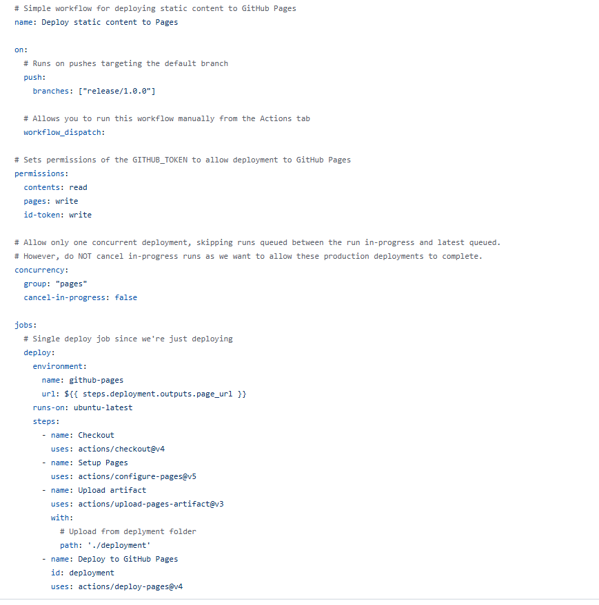
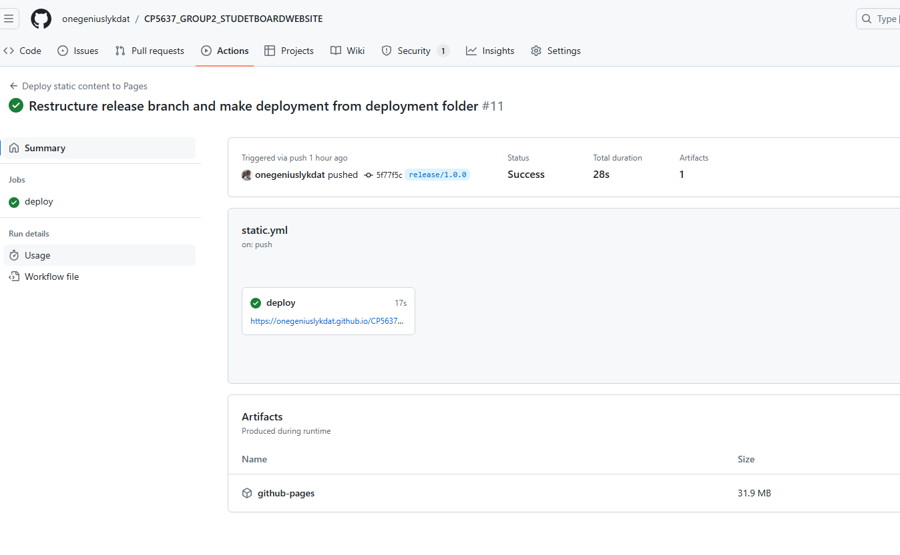

# Deployment of the project
This document outlines the comprehensive workflow for developing, testing, and deploying the JCUB Student Board website.

## Introduction

The team used trello to manage  and allocate task to the individual according to their skill set. The task was allocated according to the website pages and functionalities. There was a weekly meeting, every Thursday and Saturday for this project, where the team members discussed the project features, the challenges and how to assist each other. For communication, we used Slack (and WhatsApp as well).

Our live environment is hosted on CloudAccess.

## Local Environment 
Starting this project, every team member set up the local environment on their laptops, using either XAMPP or MMAP as the local server, with Apache, mySQL, php, Visual Studio Code and WordPress. 
The WordPress local site was installed and available on **local:8888/{the WordPress folder name}**.

## Branching
The branch structure is as follows:

- main
- dev/
- release/

Each team member has a dev branch for working on features on the website. When features are created on the local environment, they are pushed to the respective dev branch. A Pull Request is then created, requiring at least one reviewer before it can be pushed into the main branch.

After the Pull Request has been approved, the developer would then use the **Simply Static** plugin on WordPress (check [site.md](site.md#plugins)) to publish the local files to the release/ branch for staging.

## Deployment
* Staging: For deployment to the staging environment, the release branch is used. This branch contains the deplyment workflow which uses the published files from the deployment folder and then pushes them to Github Pages. Using the static.yml file, this workflow is triggered on GitHub Actions onces changes have been pushed to the branch as seen below:

* Testing: In the staging site, all team members can now see the changes on an environment that is similar to the live environment. Team members check that new features are functioning properly, UI/UX designs are optimal, exisitng features and designs are not broken, amongst other tests.

* Live: After testing is done, the files are then pushed to the live site hosted on CloudAccess using WordPress.

## Conclusion
Our deployment process follows the standard CI/CD pipeline process. Other jobs, such as security scans can as well be integrated into the deployemnt pipeline by editing the static.yml file.
